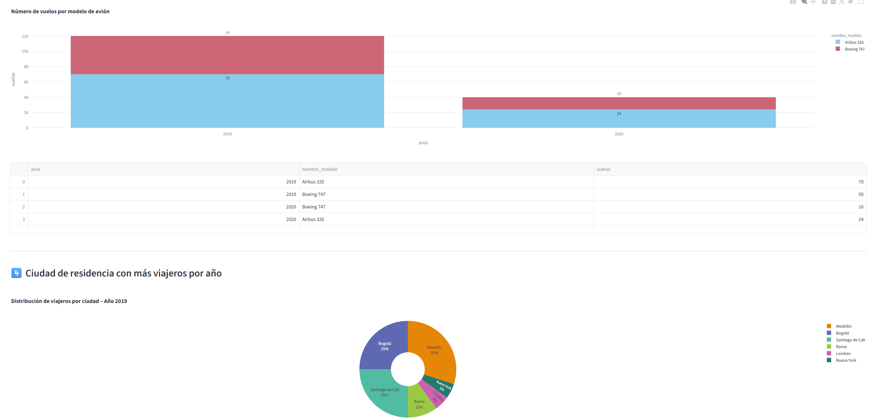
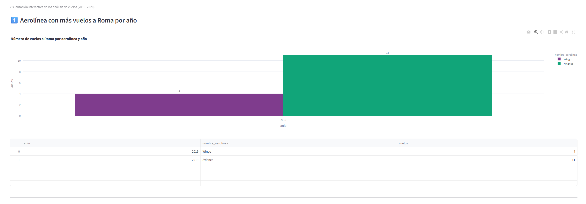
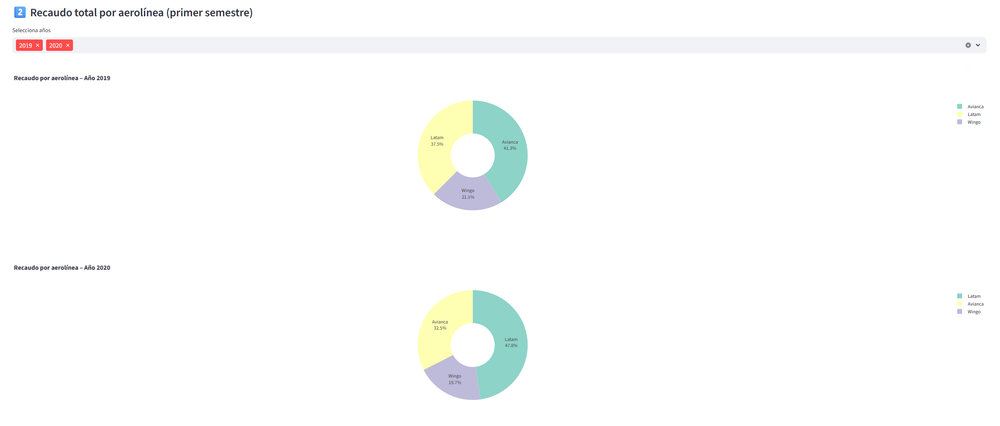

# 🛫 Mini Data Mart IATA – Análisis de vuelos 2019–2020

**Autor: Jorge Andrés Jaramillo Neme**

Este proyecto implementa un modelo estrella (Data Mart) para analizar información de vuelos globales registrada por la IATA, con énfasis en medir el impacto de la pandemia de COVID-19 sobre el transporte aéreo durante los años 2019 y 2020.

El desarrollo incluye:

- Modelo dimensional implementado en DuckDB

- Proceso ETL de carga desde una base relacional MySQL

- Dashboard interactivo en Streamlit para consultas y visualización de resultados

## Instalación
1. Clonar el repositorio
```bash
git clone https://github.com/tu-usuario/iata-datamart.git
cd iata-datamart
```

2. Crear y activar entorno virtual (opcional pero recomendado)
```bash
python -m venv venv
source venv/bin/activate   # En Linux/Mac
venv\Scripts\activate      # En Windows
```

3. Instalar dependencias
```bash
pip install -r requirements.txt
```

## ⚙️ Estructura principal del proyecto
```bash
📦 iata-datamart/
│
├── create_star_model.py      # Crea el modelo estrella en DuckDB
├── etl_iata.py               # Proceso ETL desde MySQL → DuckDB
├── consultas_resultados.py   # Consultas de verificación (texto/consola)
├── streamlit_app.py          # Dashboard interactivo
├── requirements.txt          # Librerías necesarias
└── data/
    └── iata_star.duckdb      # Base analítica local (generada)
```
🧩 Base de datos fuente (MySQL) - Credenciales en .env local.


## 🧱 Construcción del Data Mart

Ejecutar el script del modelo estrella:
```bash

python create_star_model.py
```

Cargar datos desde MySQL mediante el ETL:
```bash
python etl_iata.py
```

(Opcional) Consultar respuestas de verificación en consola:

```bash
python consultas_resultados.py
```

📊 Dashboard en Streamlit

Una vez construido el Data Mart:

```bash
streamlit run streamlit_app.py
```

Esto abrirá la aplicación web local con los análisis y visualizaciones:

- Aerolínea líder hacia Roma

- Recaudo total por aerolínea (gráfico donut)

- Modelo de avión más utilizado

- Ciudad de residencia con más viajeros

🧰 Tecnologías utilizadas

- Python 3.11
- DuckDB (Data Mart local)
- MySQL (base fuente) en cloud.
- Pandas
- Plotly Express
- Streamlit

## Algunas imagenes de muestra del dashboard:




